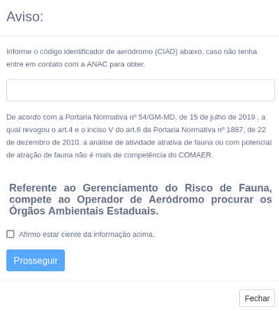

# MEMENTO DE PREENCHIMENTO DO REQUERIMENTO

## 1. SysAGA → Se credenciar → Criar um processo no [SysAGA](https://sysaga2.decea.mil.br/meusprocessos)

## 2. Escolher Alteração de cadastro da ANAC

### 2.1 O códifo CIAD do aeródromo pode ser encontrado em [aisweb](https://aisweb.decea.mil.br/?i=aerodromos&codigo=SBYA)

## 3. Preenchimento dos campos do Requerimento

* Campo A3 - Coordenada Geográfica do Aeródromo

