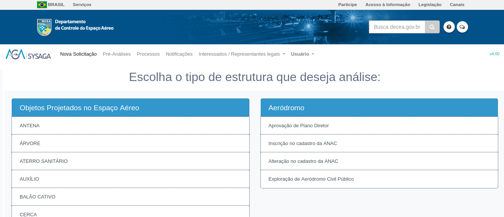

# MEMENTO DE PREENCHIMENTO DO ANEXO A (PBZPA)
___

SysAGA → Se credenciar → Criar um processo no [SysAGA](https://sysaga2.decea.mil.br/meusprocessos)

<<<<<<< HEAD

=======

>>>>>>> 702fc3e6f7ad156207caa0d588cbee66bb1d1089
