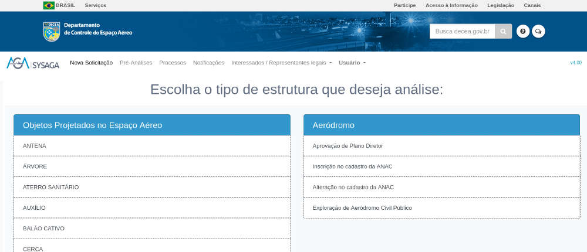
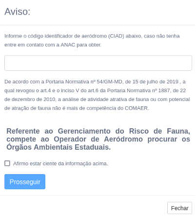
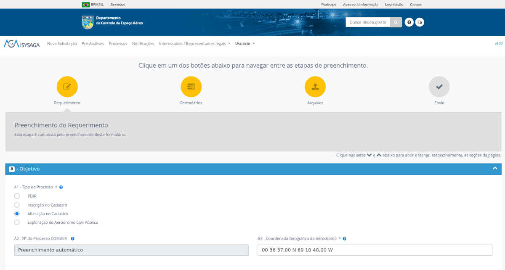

# PBZPA-metodologia

## 1. Visão geral SysAGA

* SysAGA → Se credenciar → Criar um processo no [SysAGA](https://sysaga2.decea.mil.br/meusprocessos)

* Escolher Alteração de cadastro da ANAC

* O códifo CIAD do aeródromo pode ser encontrado em [aisweb](https://aisweb.decea.mil.br/?i=aerodromos&codigo=SBYA)

* Preenchimento dos campos do Requerimento

* Campo A3 - Coordenada Geográfica do Aeródromo

## 2. Análise da legislação e superfícies de proteção

## 3. Requerimentos para o Levantamento topográfico do aeródromo

## 4. Preparo pré-campo

## 5. Memento para levantamento em campo

## 6. Gabinete

## 7. Resultados
